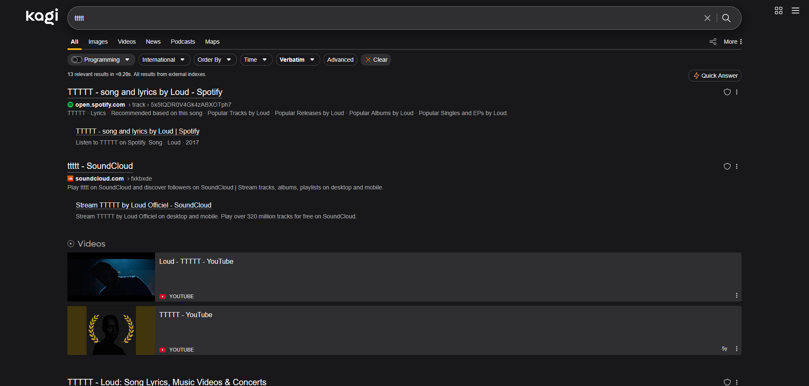
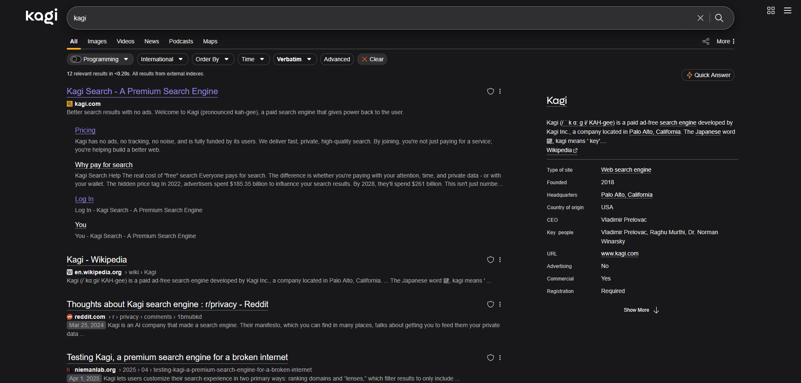
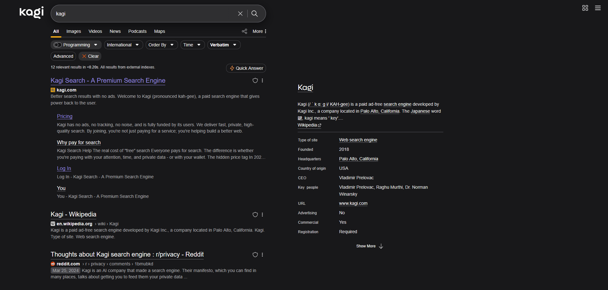
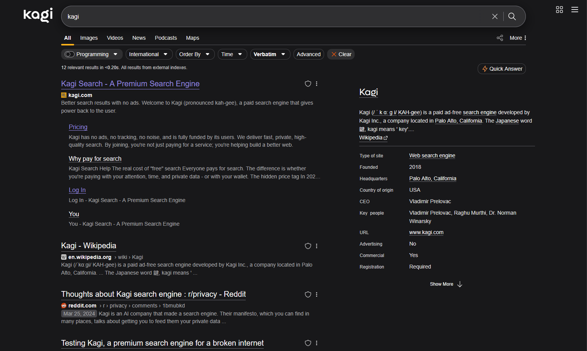
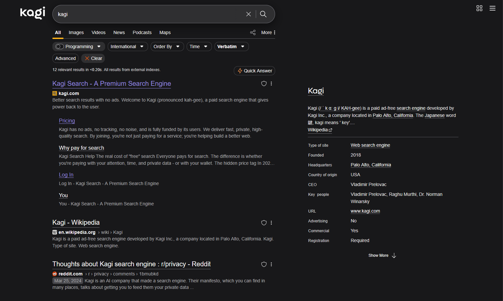
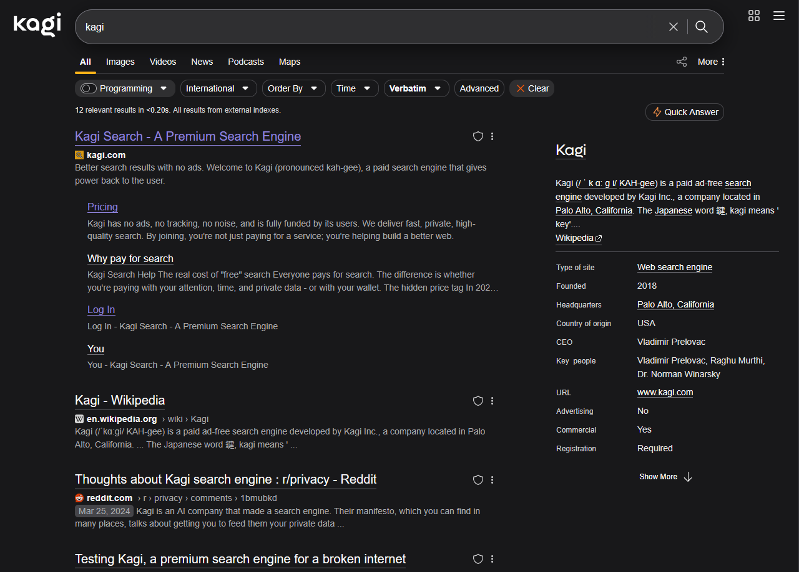
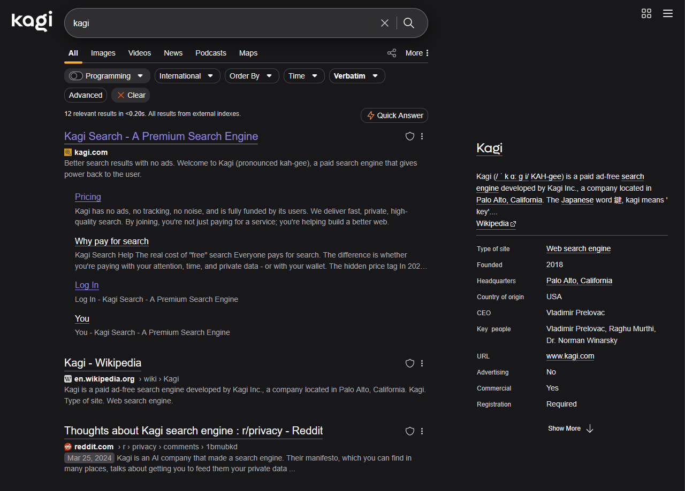
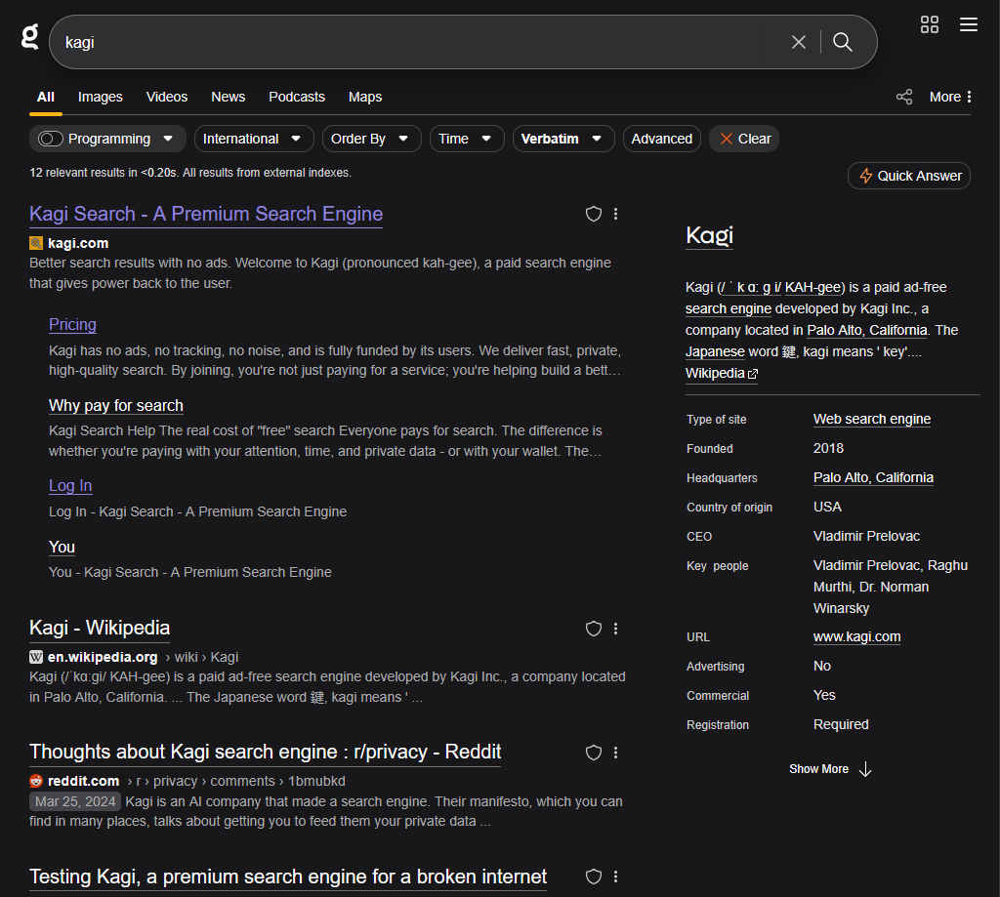
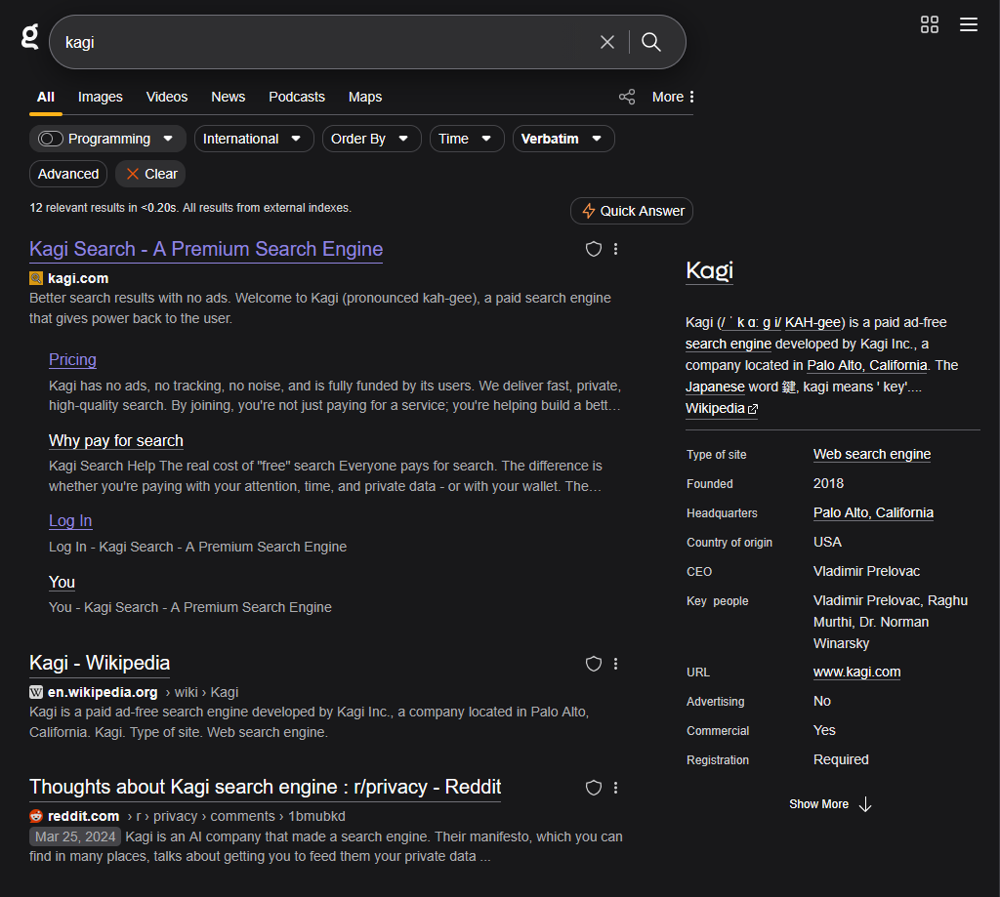
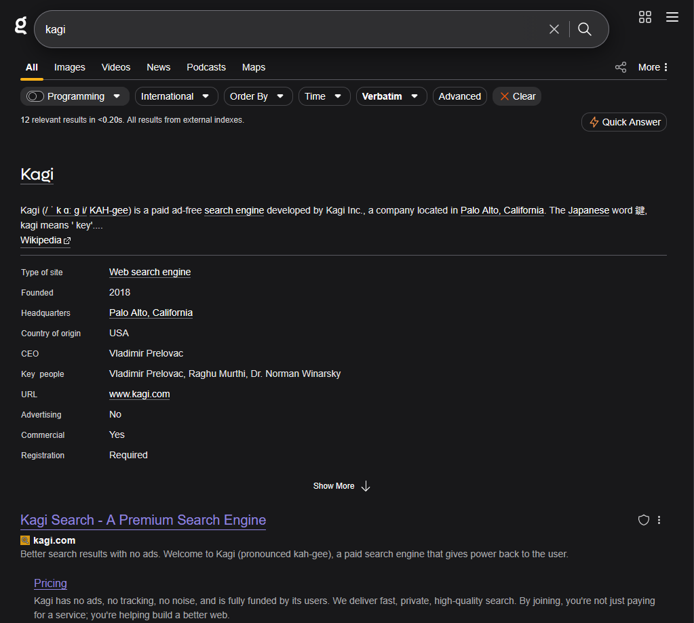

# Kagi Fullwidth

This is my CSS for a fullwidth Kagi Search.

Some may find it hideous and reject the idea of having a fullwidth search engine, but who asked ?

I decided to make this style as when i use Kagi on a large screen, i find the page a bit empty of content ; until Kagi add something on the right part of the page and/or until i'm sivk of it, i'll keep using it.

# Screenshots

## 3xl (1920px) :
### Fullwidth & Without Card :

### No CSS & Without Card:

### Fullwidth With Card :

### No CSS With Card :

### 2xl (1536px) :
### Fullwidth :

### No CSS :

## xl (1280px) :
### Fullwidth :

### No CSS :

## lg (1024px) :
### Fullwidth :

### No CSS :

## Below

Starting from 1023px and below, the CSS do not change anything. \
However, here's a reminder of what Kagi look like at this size :
